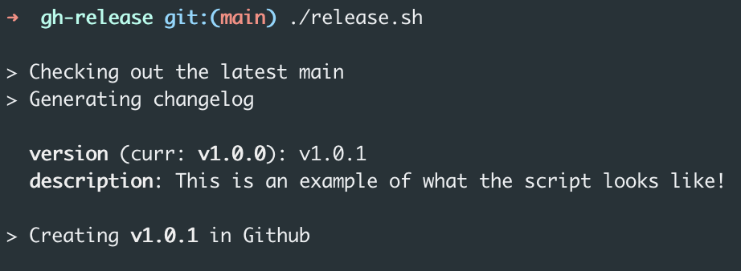
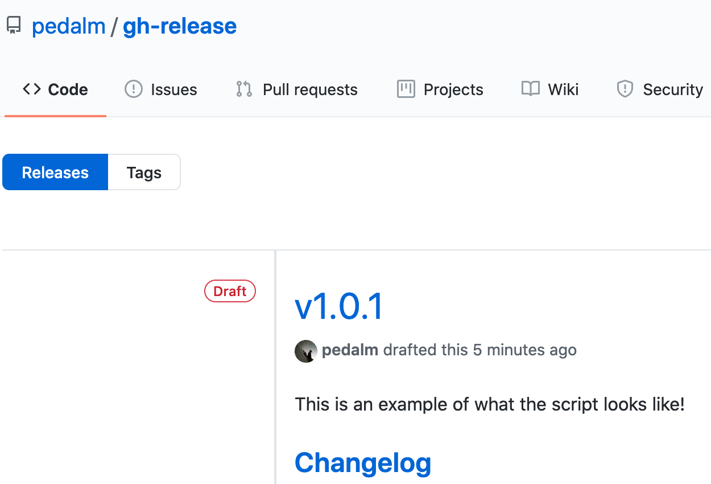

# GitHub Release
Script to automate/standardise the creation of GitHub releases.

### Requirements
* [GitHub's CLI](https://github.com/cli/cli#installation)

##### Install
After you clone this repository, the easiest approach would be to add an alias to your shell to the directory of where
you've cloned the repo.

> alias ghrelease=". /<#CHANGE_ME#>/gh-release/release.sh"

### Usage

After execution, the script will open the new (draft) release on your default browser, where you can confirm/edit any
details and decide to whether discard or publish that release.

Keep in mind that **until you publish the release**, it will **not** be considered as an actual release
(so no hooks will be triggered).
