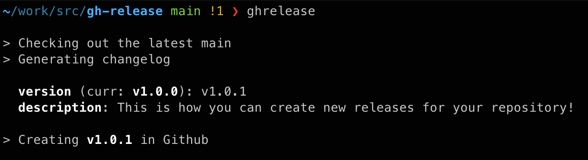
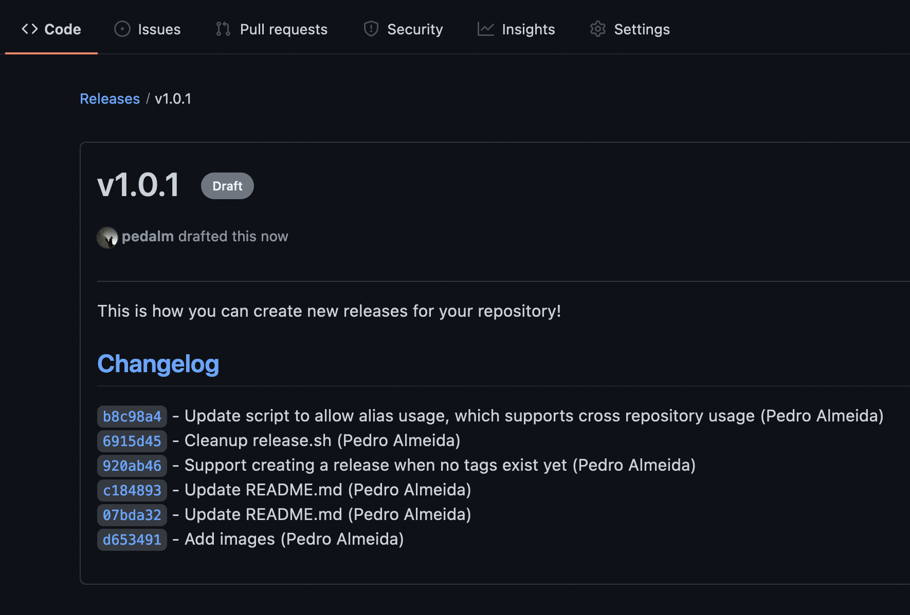

# GitHub Release
Script to automate/standardise the creation of GitHub releases.

### Requirements
* GitHub Cli
To install, please follow the recommended steps in the cli's [documentation](https://github.com/cli/cli#installation).

### Usage
Simply add [release.sh](./release.sh) and the [template](./.github/RELEASE_TEMPLATE.md) to your repository.

Remember to adjust [release.sh's line 5](https://github.com/pedalm/gh-release/blob/main/release.sh#L5) to your correct repository URL.

After this, you can simply execute the script with `./release.sh` and you should be met with the following:

After executing, the script will automatically open the brand new release, created as a draft, in your default browser.

From here, you can either decide to publish it or to discard the draft.
